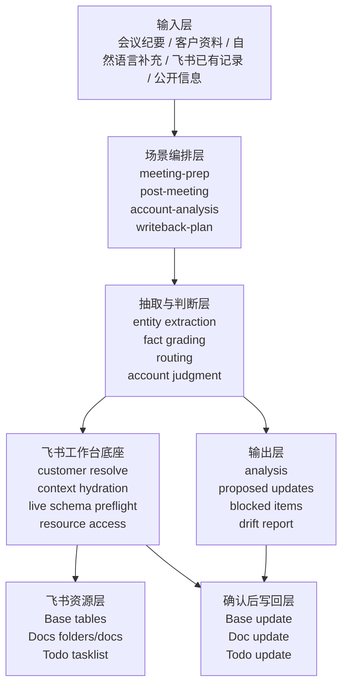
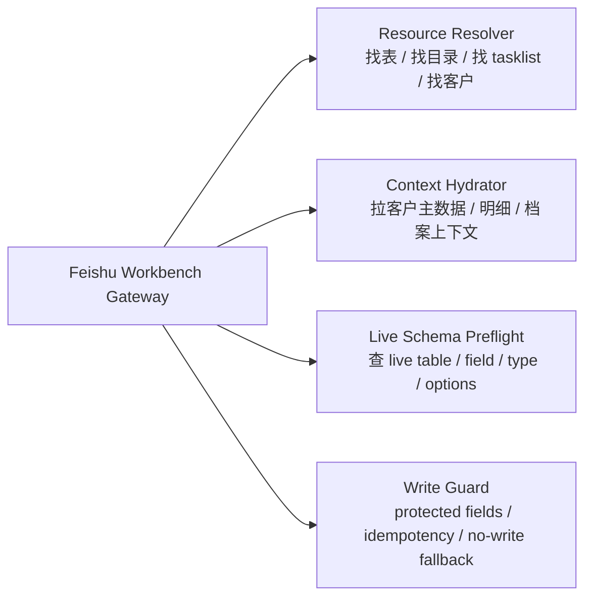
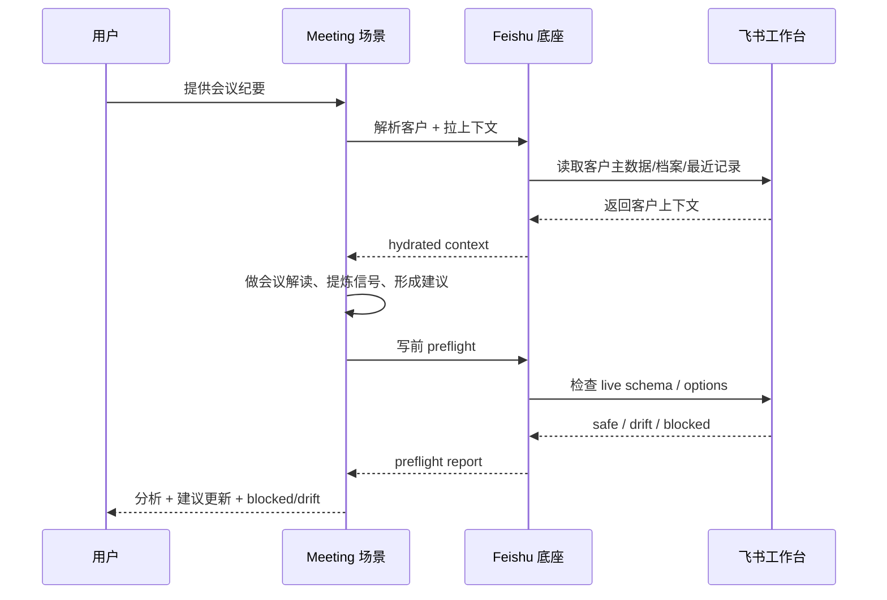

# Architecture

本文档定义 `feishu-am-workbench` 当前阶段的整体架构。

目标不是先把它做成“可配置平台”或“给别人复用的通用组件”，而是先把它做成：

- 对你个人真实 AM 工作可用
- 可支撑会议纪要、会后更新、会前准备等高频场景
- 在 skill 内部具备稳定、可复用的飞书工作台访问底座

---

## 当前阶段结论

这轮架构审查结论如下：

- 方向正确：
  - 会议场景不应直接单文件分析
  - 应先恢复客户上下文，再做经营判断
  - 应把飞书访问能力沉到 skill 内部公共底座
- 当前主线：
  - 优先服务你个人高频使用价值
  - 优先解决“能上飞书拿上下文”和“写前可安全校验”
  - 不把近期主线切到多人配置、统一配置中心或平台抽象
- 当前明确不做：
  - 不以 `config/local.<owner>.yaml` 为前提推动当前版本
  - 不先做给其他人复用的环境配置模型
  - 不先做重型 runtime 抽象

---

## 架构总览

整体上分为 6 层：

1. 输入层
2. 场景编排层
3. 抽取与判断层
4. 飞书工作台底座
5. 输出层
6. 写回层

---

## 各层职责

## 1. 输入层

负责接收不同类型输入，但不直接做写回决策。

输入包括：

- 会议纪要
- 会中逐字稿
- 客户材料
- 用户自然语言补充
- 飞书已有记录
- 客户公开资讯

原则：

- 输入先归档为“待解释材料”
- 不因为输入来源不同而绕过统一判断流程

## 2. 场景编排层

负责决定本次任务属于哪种工作流。

当前优先支持：

- `meeting-prep`
- `post-meeting`
- `account-analysis`
- `archive-refresh`

这一层的职责不是做业务判断，而是：

- 识别场景
- 决定需要恢复哪些上下文
- 决定调用哪些下游能力

## 3. 抽取与判断层

这是 skill 的业务内核。

负责：

- extraction bundle
- facts vs judgment
- update routing
- account judgment
- open questions
- change plan

这一层不应该直接依赖某个固定字段名或表名。
它只依赖更高层的业务对象，例如：

- 客户
- 联系记录
- 行动项
- 档案
- Todo

## 4. 飞书工作台底座

这是当前架构最关键的一层。

它是 skill 内部的公共能力层，供多个场景复用，不是为“别人也能用这个 skill”而设计的公共平台。

它的存在意义是：

- 不让会议纪要、会后更新、客户分析各自重写一套飞书读取逻辑
- 把飞书资源访问、上下文恢复、写前校验沉到底层统一处理

当前仓库中，这一层已经开始落地到：

- [runtime/](/Users/liaoky/.codex/skills/feishu-am-workbench/runtime)

但当前只完成了本地执行骨架和统一数据模型，live Feishu adapter 仍然是下一步。

建议拆成 4 个内部能力：

### 4.1 Resource Resolver

负责找到当前任务需要访问的飞书对象。

包括：

- 客户主数据
- 行动计划
- 客户联系记录
- 客户档案目录
- 会议纪要目录
- Todo tasklist

当前阶段允许它依赖现有 skill 中已经存在的真实资源线索。
不要求先抽成统一配置中心。

具体执行应遵守：

- [feishu-runtime-sources.md](/Users/liaoky/.codex/skills/feishu-am-workbench/references/feishu-runtime-sources.md)
- [feishu-workbench-gateway.md](/Users/liaoky/.codex/skills/feishu-am-workbench/references/feishu-workbench-gateway.md)

### 4.2 Context Hydrator

负责为需要深度解释的场景补齐上下文。

当前最重要的调用方是：

- 会议纪要
- 会后更新
- 会前准备

最小上下文恢复顺序应与 [meeting-context-recovery.md](/Users/liaoky/.codex/skills/feishu-am-workbench/references/meeting-context-recovery.md) 保持一致：

1. `客户主数据`
2. 最近 `客户联系记录`
3. 最近 `行动计划`
4. 客户档案
5. 相关历史会议纪要

### 4.3 Live Schema Preflight

负责写前真实校验，而不是只靠静态快照。

检查内容包括：

- 表是否存在
- 字段是否存在
- 字段类型是否匹配
- `select` / `multi_select` 选项是否还可写
- 是否存在 drift

这层应遵守 [live-schema-preflight.md](/Users/liaoky/.codex/skills/feishu-am-workbench/references/live-schema-preflight.md)。

### 4.4 Write Guard

负责最终写前保护。

包括：

- protected field policy
- idempotency
- Todo owner requirement
- semantic dedupe
- no-write fallback

## 5. 输出层

统一输出给用户的内容。

当前推荐结构：

1. 上下文恢复与会议 framing
2. 确认事实与经营判断
3. 结构化摘要
4. 建议态更新
5. blocked items / open questions
6. 仅在确认后返回写入结果

输出层的重点是：

- 可审计
- 可解释
- recommendation mode 明确
- drift 与 blocked 明确

## 6. 写回层

只在用户确认后执行。

写回顺序保持不变：

1. Base tables
2. supporting docs
3. Todo

原则：

- 写前必须经过 live schema preflight
- 任何 unsafe 情况都停在 recommendation mode
- 不为了“写成功”而发明 fallback 值

---

## 关键调用链

以“会议纪要”场景为例：

这条链路强调：

- 会议场景不直接访问飞书细节
- 飞书访问和写前校验由底座统一处理
- 上层场景只处理经营解释和输出

---

## 当前优先实现顺序

按当前 roadmap，近期优先做：

1. `Feishu Workbench Gateway`
   - 先让会议场景能读取客户上下文
2. `Live Schema Preflight`
   - 先覆盖 `客户主数据`、`行动计划`、必要的 Todo
3. `Meeting Context Hydration`
   - 让会议纪要和会后更新真正基于历史上下文运行
4. `Validation`
   - 用真实会议场景回归验证 recommendation mode 输出

当前后置：

- 多人复用配置
- 通用配置中心
- 重型平台抽象

---

## 本轮审查结论

### CEO 视角

- 问题选得对：
  - 当前最值钱的问题不是“如何通用化”，而是“如何让会议类高频场景真实可用”
- scope 合理：
  - 把飞书底座做成 skill 内部公共能力，能同时服务多个场景，又不会过早进入平台化泥潭

### Design 视角

- 本轮无 UI 范围
- 但信息流设计合理：
  - 上下文恢复
  - 事实与判断分离
  - recommendation mode
  - blocked / drift 明示

### Eng 视角

- 当前最关键的边界划分正确：
  - 场景层不直接操作飞书资源
  - 飞书访问、schema 检查、写前保护下沉到底座
- 当前最需要避免的错误也明确：
  - 把 live schema 兼容误做成统一配置工程
  - 把会议场景和底座能力耦在一起

---

## 冲突控制建议

如果另一个分支正在做会议场景开发，当前这份架构文档本身冲突风险较低。

低冲突前提：

- 会议分支主要改：
  - `references/meeting-*`
  - `SKILL.md`
  - 验证样本
- 当前分支主要新增：
  - `ARCHITECTURE.md`

高冲突区域主要会出现在这些文件：

- `SKILL.md`
- `README.md`
- `ROADMAP.md`
- `CHANGELOG.md`

因此当前建议：

- 架构先落到单独新文件
- 暂时不大改已有主文档
- 等会议场景分支稳定后，再做 README / roadmap 的统一收口
